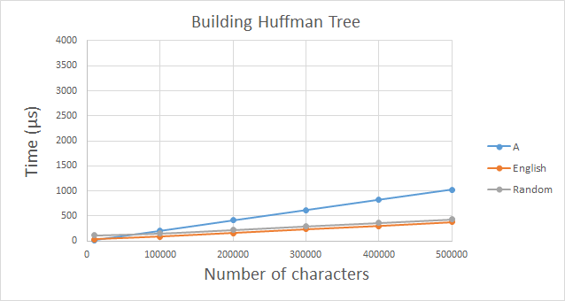
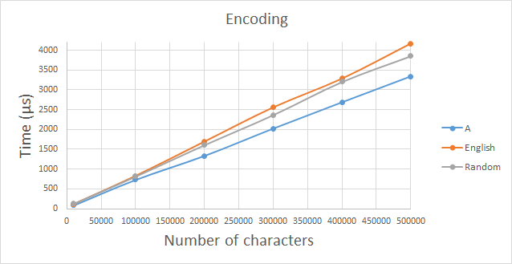
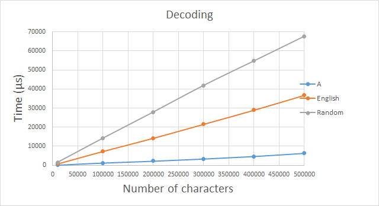

# Testausdokumentti

Pakkauksen ja sen tehokkuuden testaamisessa käytettiin kolmea erilaista tekstityyppiä: pelkkää A-kirjainta sisältävää, englanninkielistä tekstiä ja sattumanvaraisesti generoituja merkkejä (merkitty kuvaajissa ja taulukoissa "A", "Englanti" ja "Random"). Tehokkuutta testattiin kuudella eri kirjain määrällä: 10000, 100000, 200000, 300000, 400000 ja 500000.

Englannin kielisenä tekstinä käytettiin: [The Legends Of King Arthur And His Knights](http://www.gutenberg.org/cache/epub/12753/pg12753.txt), josta otettiin testeissä mainitun verran määrän kirjaimia mukaan alusta laskien.

## Yksikkötestaus

Projektissa on käytössä Google Test -ohjelmistokehys, jonka avulla koodin teknistä toimivuutta testataan. Testien kattavuudet ovat nähtävissä [täältä](https://htmlpreview.github.io/?https://github.com/MatiasLyyra/HuffmanCoding/blob/master/dokumentaatio/coverage/index.html).

## Pakkauksen testaus

Tekstityyppi (kirjainten määrä) | Alkuperäinen koko | Pakattu koko
-------------------| ----------------- | ------------
A (10000) | 10 000 tavua | 1 272 tavua
A (500000) | 500 000 tavua | 62 520 tavua
Englanti (10000) | 10 000 tavua | 6 180 tavua
Englanti (500000) | 500 000 tavua | 279 612 tavua
Random (10000) | 10 000 tavua | 10 336 tavua
Random (500000) | 500 000 tavua | 500 336 tavua

Yhtä merkkiä sisältävän tiedon pakkaaminen on oletetusti tehokasta, koska pakatussa muodossa kyseistä merkkiä voidaan esittää yhdellä bitillä. Englanninkielisen tekstin kohdalla pakkaus onnistui myös kohtuullisen hyvin, johtuen [eri merkkien erilaisista esiintymistodennäköisyyksistä](https://en.wikipedia.org/wiki/Letter_frequency#Relative_frequencies_of_letters_in_the_English_language). Sattumanvaraisesti luotua tekstiä ei voitu pakata ja suurempi koko johtuu pakkaukseen liittyvän ylimääräisen datan tallentamisesta. Kaikki merkit (0-255) esiintyvät yhtä suurella todennäköisyydellä, joten pakkauksen jälkeenkin yksittäisen merkin esittämiseen tarvitaan keskimäärin kahdeksan bittiä.

## Tehokkuuden testaus

Tiedostot pakattiin/purettiin 5000 kertaa peräkkäin. Tämän ajan keskiarvoa käytettiin tuloksena. Ohjelma käännettiin GCC:n optiolla ``-O3 -g -Wall -Wextra -Werror -m64``

### Huffman Puun rakentaminen

Tulos oli melko yllättävä "A":n kohdalta. Olisi voinut olettaa, että "A" olisi ollut vähintäkin yhtä nopea kuin muut testiaineistot. Tarkemman testauksen perusteella ero tulee kohdasta koodia, joka [laskee eri kirjainten esiintyvyyksien määrät](https://github.com/MatiasLyyra/HuffmanCoding/blob/b6ef5edd13003b89ceb33873e66b3c596aa0a1a4/huffman/HuffmanTree.cpp#L14). "English" ja "Random" puolestaan olivat oletusten mukaiset ja noudattivat määrittelydokumentin aikavaativuusarviota O(n + k log k), jossa kirjainten määrä vaikuttaa enemmän kuin erilaisten kirjainten määrä.

### Datan pakkaaminen

Diagrammi näyttäisi noudattavan melko hyvin määrittelydokumentin aikavaativuusarviota O(n + k). Kuvaajasta voidaan huomata, että ajankulutukseen vaikuttaa suurimmaksi osaksi merkkien kokonaismäärä ja eri merkkien määrällä on suhteellisen pieni merkitys.

### Datan purkaminen

Määrittelydokumentin aikavaativuusarvio O(nh) näyttäisi olevan paikallaan purkamisen kohdalla. Merkkien määrä aiheuttaa suuremman kulmakertoimen "Random" ja "English" testiaineistojen kohdalla verrattuna "A" testiaineistoon.
