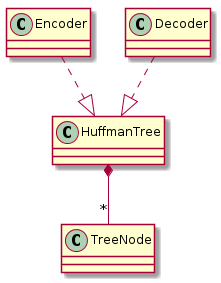
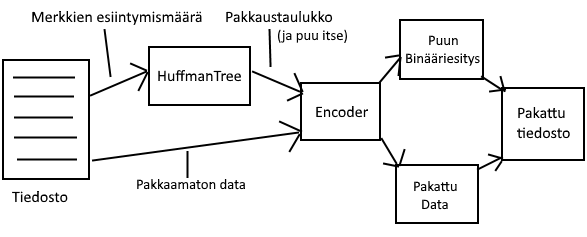
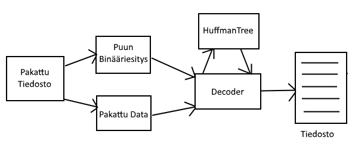

# Toteutusdokumentti

## Ohjelman yleisrakenne



### Tärkeimpien luokkien kuvaus

HuffmanTree - Sisältää joukon toisiinsa linkitettyjä puusolmuja. Kyseinen rakenne voidaan muodostaa datasta merkkien esiintymismäärien perusteella tai rakentaa olemassa olevan puun perusteella (katso pakatun tiedoston rakenne).

TreeNode - Yksinkertainen datarakenne, jonka tarkoitus on pitää viitettä mahdollisiin lapsisolmuihin ja dataan.

Encoder - Luokan tehtävänä on pakata sille annettu data käyttäen Huffman puusta muodostettua pakkaustaulukkoa. Luokka on myös vastuussa Huffman puun muuttamisesta sopivaan muotoon tiedostoon pakkaamista varten.

Decoder - Luokan tehtävänä on purkaa sille annettu data, käyttäen Huffman puuta.

### Pakkauksen toiminta



### Purkamisen toiminta



### Pakatun tiedoston rakenne

Pakattu tiedosto koostuu kolmesta osasta: taikanumero, Huffman puu binäärimuodossa ja itse pakattu data. Kumpaakin jälkimmäistä osaa edeltää 64-bittinen etumerkitön kokonaisluku little-endian muodossa, joka kertoo sitä seuraavan osan pituuden biteissä. Taikanumero sijaitsee heti tiedoston alussa ja on myös tallennettu little-endian muodossa. Puu on tallennettu esijärjestyksessä siten, että 0/False merkitsee jokaista solmua, jolla on lapsisolmuja, ja 1/True jokaista lehtisolmua. Lehtisolmua seuraa 8 bittiä, joka kertoo kyseisen lehtisolmun datan.

## Aika ja tilavaativuudet

### Huffman puun rakentaminen

```
function constructTree(Vector characters)
    priority_queue queue

    frequencies = calculateCharacterFrequencies(characters)
    for each character c in CHARACTERS
        if (frequencies[c] != 0)
            TreeNode leaf
            leaf.data = c
            leaf.frequency = frequencies[c]
            leaf.left = leaf.right = null
            queue.push(leaf)
        endif
    endfor

    while queue.size() > 1
        TreeNode left = queue.pop()
        queue.pop();
        TreeNode right = queue.pop()

        TreeNode parent
        parent.frequency = left.frequency + right.frequency
        parent.left = left
        parent.right = right
        queue.push(parent)
    endwhile

    setRoot(queue.pop())
endfunction


calculateCharacterFrequencies(Vector characters)
    Array frequencies

    for each character c in characters
        ++frequencies[c]
    endfor

    return frequencies
endfunction
```
Aikavaativuus "calculateCharacterFrequencies" funktiolla on O(n), jossa n on characters taulukossa olevien merkkien määrä. Aikavaativuus prioteettijonon täyttämisessa funktiossa "constructTree" on O(k log k) (binäärikekoon lisääminen ja poistaminen O(log k), joka tehdään k kertaa), jossa k on erilaisten merkkien määrä. Prioriteettijonoa purkaessa sieltä poistetaan aina kaksi solmua ja lisätään yksi. While-lauseke suoritetaan siis k kertaa, joten koko silmukan aikavaativuus on myös O(k log k). Kokonaisuudessaan aikavaativuus on O(n + k log k) ja tilavaativuus O(k).

### Pakkaaminen

```
function writeTreeInBinary(root, huffmanTree, treeInBinary)
    if root->isLeaf()
        treeInBinary.push_back(true)
        insertByte(root.getData(), treeInBinary)
    else
        treeInBinary.push_back(false)
        writeTreeInBinary(root.getLeftChildHandle(), huffmanTree, treeInBinary)
        writeTreeInBinary(root.getRightChildHandle(), huffmanTree, treeInBinary)
    endif
endfunction

function collectCharacterCodes(encode_table, root, code, depth)
    if root.isLeaf()
        //Handle special case where there is only one character
        if depth == 0
            depth = 1
        endif
        encode_table[root.getData()] = pair(code, depth)
    else
        uint leftCode = code << 1
        uint rightCode = (code << 1) + 1
        ++depth

        collectCharacterCodes(encode_table, root.getLeftChildHandle(), leftCode, depth)
        collectCharacterCodes(encode_table, root.getRightChildHandle(), rightCode, depth)
    endif
endfunction

function encodeData(encode_table, data)
    BinaryVector encodedData
    for each byte in data
        encode_entry = encode_table[byte]
        code = encode_entry.first
        length = encode_entry.second
        encodedData.push_back(code, length)
    endfor
    return encodedData
endfunction
```
Funktion "writeTreeInBinary" aikavaativuus on selvästi (jokaisessa solmussa vieraillaan vain kerran) O(k), jossa k on erilaisten merkkien määrä. "insertByte" on vakioaikainen funktio, joka sijoittaa 8 bittiä taulukon loppuun.

Funktio "collectCharacterCodes" on erittäin samanlainen kuin "writeTreeInBinary" ja aikavaativuus on myöskin O(k). Lopuksi data pakataan pakkaustaulukon avulla funktiossa "encodeData". Siinä jokainen merkki/tavu käydään läpi ja tallennetaan "encodedData" taulukkoon, jolloin aikavaativuus on O(n), jossa n on merkkien määrä datassa. Kokonaisuudessaan aikavaativuus on O(n + k). Tilavaativuus on myöskin koko pakkauksen ajalla O(n + k) pakatun datan ja pakkaustaulukon takia.

### Purkaminen

```
function readNodes(treeInBinary, index)
    if treeInBinary[index++] == 1
        byte = readByte(treeInBinary, index)
        index += 8
        TreeNode leaf(byte)
        return leaf
    endif

    TreeNode parent
    parent.left = readNodes(treeInBinary, index)
    parent.right = readNodes(treeInBinary, index)

    return parent
endfunction

function decodeData(treeInBinary, encodedData)
    HuffmanTree = readNodes(treeInBinary, 0)
    Vector decodedData
    TreeNode current
    for i in range 0 -> encodedData.size()
        current = huffmanTree.getRoot()
        //Handling special case with only one character
        i += current.isLeaf() ? 1 : 0
        while !current->isLeaf() and i < encodedData.size()
            current = encodedData[i] == 1 ? current.getRightChild() : current.getLeftChild()
            ++i
        endwhile
        decodedData.push_back(current.getData())
    endfor
    return decodedData
endfunction
```
Funktion "readNodes" jokainen solmu Huffman puun solmu käydään kertaalleen läpi, joten aikavaativuus on O(k), jossa k on erilaisten merkkien määrä. "readByte" on vakioaikainen funktio, joka lukee seuraavat kahdeksan bittiä taulukosta. "decodeData"-funktiossa jokainen merkki datassa käydään läpi for-silmukassa. Pahimmassa tapauksessa lehtisolmu löytyy puun korkeuden verran solmuja läpikäytyä. Tällöin siis aikavaativuus on yhteensä O(nh + k), jossa n on merkkien määrä datassa ja h on Huffman puun korkeus.

## Parannusehdotukset

Tiedon purkaminen on huomattavasti hitaampaa verrattuna tiedon pakkaamiseen. Purkamista voisi mahdollisesti nopeuttaa käyttämällä hakutaulukkoa. Toinen parannusmahdollisuus olisi sisällyttää pakattuun tiedostoon tarkistussumma, jolla tiedoston eheys voitaisiin tarkistaa ennen purkamista.

